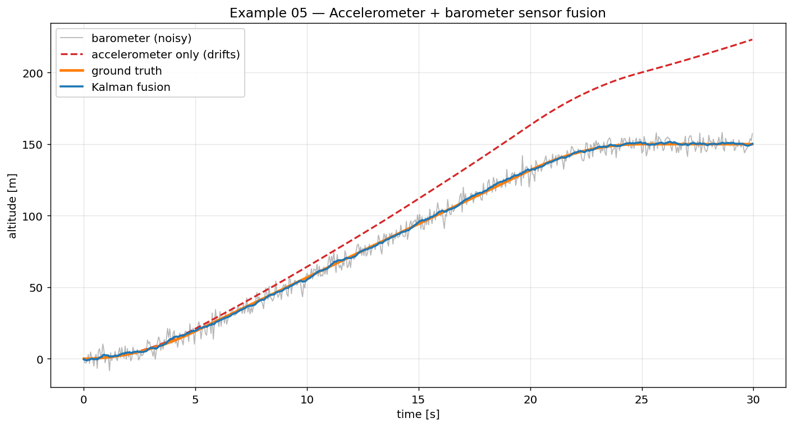
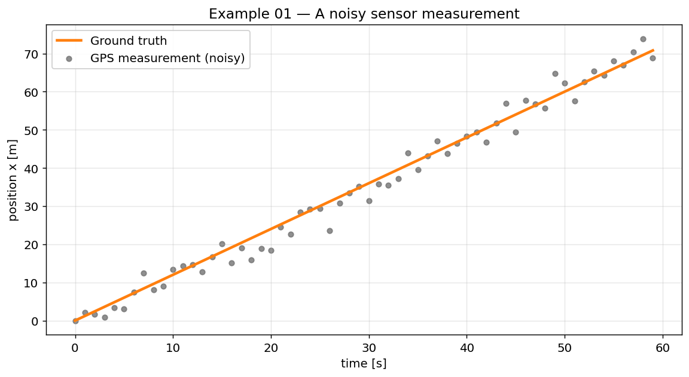
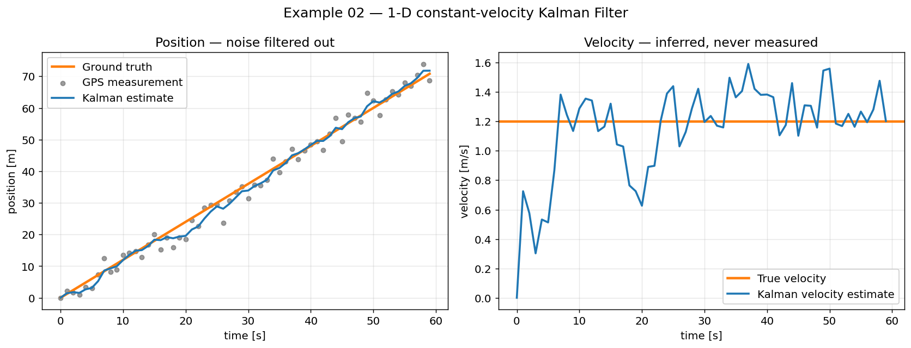
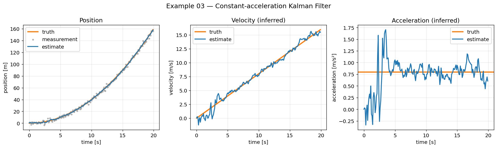
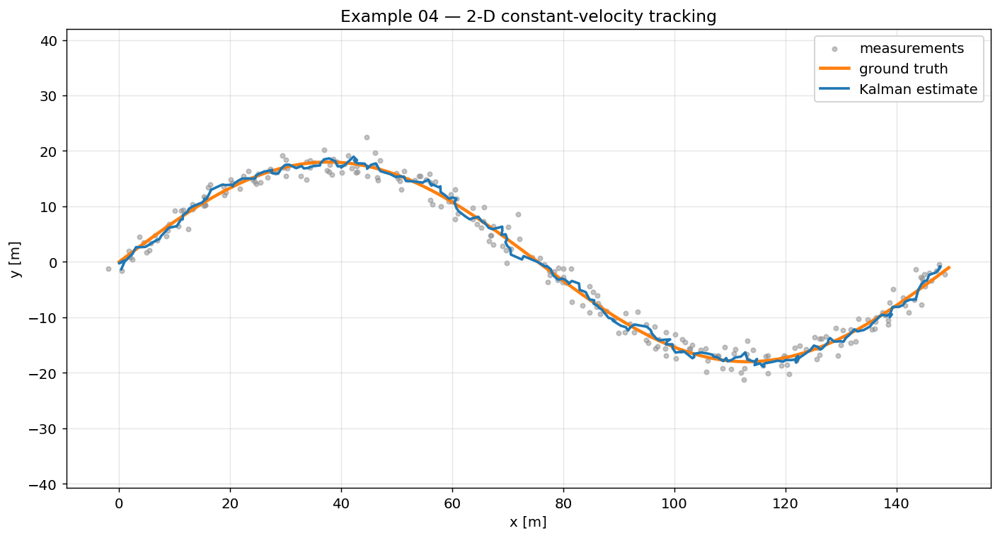
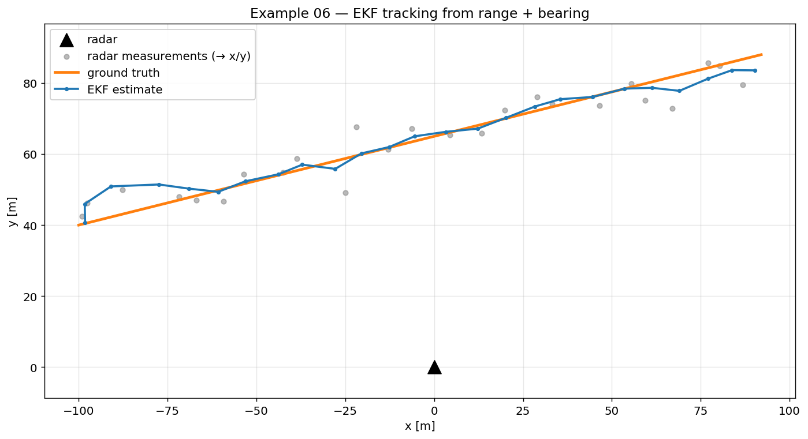
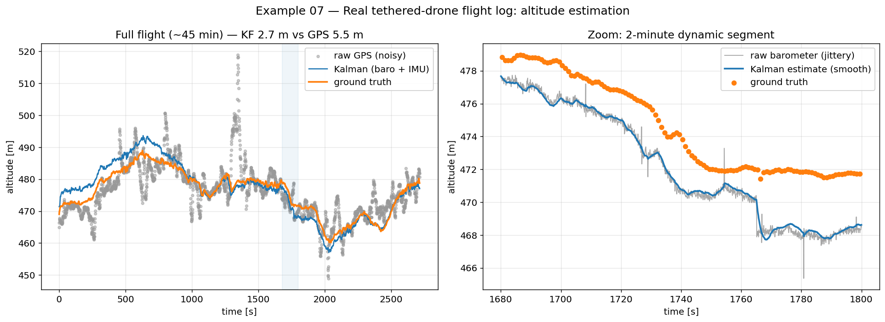

# Kalman Filter — A Hands-On Tutorial

A practical, from-scratch tour of the **Kalman Filter** in Python: a tiny reusable
library plus seven progressive, runnable examples — from a one-line GPS smoother
all the way to fusing real drone flight-log sensors. Every figure in this README
is produced by the code in [`examples/`](examples).

<p align="center">
  
</p>

---

## 🎯 What is a Kalman Filter?

A Kalman Filter estimates the hidden **state** of a system (position, velocity,
altitude…) from a stream of **noisy measurements**. It is *optimal* for
linear systems with Gaussian noise and is everywhere: GPS/INS navigation, drones,
robotics, finance, and the sensor fusion in your phone.

The key idea: maintain not just an estimate, but **how uncertain** that estimate is
(a covariance). Each step blends two sources of information in proportion to their
uncertainty:

1. a **prediction** from a motion model ("where should it be next?"), and
2. a **measurement** from a sensor ("where does the sensor say it is?").

Trust whichever is currently more certain. That blend is the **Kalman gain**.

## 🔁 The predict–update cycle

```
        ┌─────────────┐        ┌─────────────┐
   ───▶ │   PREDICT   │ ─────▶ │   UPDATE    │ ─────▶  estimate
        │ motion model│        │ measurement │
        └─────────────┘        └─────────────┘
              ▲                        │
              └────────────────────────┘
```

**Predict** — project the state and its uncertainty forward:

```
x = F x (+ B u)
P = F P Fᵀ + Q
```

**Update** — correct the prediction with a measurement `z`:

```
y = z − H x                 innovation (what the sensor adds)
S = H P Hᵀ + R              innovation covariance
K = P Hᵀ S⁻¹               Kalman gain
x = x + K y
P = (I − K H) P
```

| Symbol | Meaning |
| :---: | --- |
| `x`, `P` | state estimate and its covariance |
| `F`, `B` | motion model and (optional) control matrix |
| `H` | maps state → measurement |
| `Q`, `R` | process- and measurement-noise covariances |
| `K` | Kalman gain (how much to trust the measurement) |

For **non-linear** models we linearise `f`/`h` through their Jacobians at each step —
that is the **Extended Kalman Filter (EKF)**, used in example 06.

## 📂 Repository layout

```
kalman/                          # the from-scratch library
├── kalman_filter.py             # linear KalmanFilter (Joseph-form update)
└── extended_kalman_filter.py    # ExtendedKalmanFilter (EKF)
examples/                        # progressive, self-contained demos (each saves a figure)
figures/                         # generated plots (shown below)
data/                            # real flight log goes here (git-ignored)
```

## 📦 The library in 10 lines

```python
import numpy as np
from kalman import KalmanFilter

dt = 1.0
kf = KalmanFilter(
    F=np.array([[1, dt], [0, 1]]),   # constant-velocity model
    H=np.array([[1, 0]]),            # we measure position only
    Q=np.diag([0.05, 0.05]),         # process noise
    R=np.array([[9.0]]),             # measurement noise
    x0=[0, 0], P0=np.diag([10, 10]),
)
for z in measurements:
    kf.predict()
    kf.update(z)
    print(kf.state)                  # [position, velocity]
```

---

## 📚 Examples

### 01 · A noisy measurement
The problem we are solving: a sensor reports a moving object's position, but every
reading is corrupted by noise. Can we recover the smooth truth?



### 02 · 1-D constant velocity
The classic first filter. Measuring **only position**, the Kalman Filter both
cleans up the signal *and* infers the velocity it was never told.
**Result: position RMSE 2.7 m → 1.7 m**, plus a velocity estimate for free.



### 03 · Constant acceleration
Add acceleration to the state and the filter follows a manoeuvring target,
estimating position, velocity **and** acceleration from position alone.



### 04 · 2-D object tracking
A 4-state `[x, vx, y, vy]` filter tracks a target along a curved path from noisy
`(x, y)` fixes. **Track RMSE 2.2 m → 0.9 m.**



### 05 · Sensor fusion — accelerometer + barometer
No single sensor is enough: an accelerometer integrated twice **drifts**, a
barometer is **noisy**. Fusing them (accelerometer drives the prediction, barometer
corrects it) beats either alone — **altitude RMSE: baro 4.0 m, accel-only 32 m,
fusion 0.8 m.**


### 06 · Extended Kalman Filter — radar tracking
A radar measures **range and bearing** — non-linear functions of position. The EKF
linearises the measurement model at each step to track the target in `x/y`.



### 07 · Real flight log — drone altitude (case study)
The filter applied to a **real ~45-minute tethered-drone flight log**. We fuse the
onboard **barometer** with **IMU** vertical acceleration (rotated to the world frame
via the attitude quaternion) and validate against survey-grade ground truth.
The fused estimate follows ground truth within **2.7 m**, while raw **GPS is 5.5 m**
off; the zoom panel shows the filter smoothing real barometer jitter.



> The raw flight log is not committed (size + licensing). See [`data/README.md`](data/README.md)
> to reproduce; every other example is fully self-contained.

---

## ▶️ Running

```bash
pip install -r requirements.txt
python examples/02_1d_constant_velocity.py     # any example; figures land in figures/
```

## 📖 References

- R. E. Kálmán (1960), *A New Approach to Linear Filtering and Prediction Problems.*
- G. Welch & G. Bishop, *An Introduction to the Kalman Filter.*
- R. Labbe, *Kalman and Bayesian Filters in Python.*

## 📄 License

Released under the [MIT License](LICENSE).
